# 🚢 Titanic Prediction

This Jupyter Notebook is designed to predict the survival of passengers aboard the Titanic using random forest techniques. 

The dataset used for this analysis is sourced from the Kaggle Titanic Competition: https://www.kaggle.com/competitions/titanic


## 📚 Library Import 

Firstly, we import all the library we need for this project


```python
import pandas as pd
import matplotlib.pyplot as plt
import seaborn as sns
import numpy as np
from sklearn.model_selection import train_test_split, cross_val_score
from sklearn.metrics import accuracy_score
from sklearn.model_selection import cross_val_score
from sklearn.model_selection import GridSearchCV
from sklearn.ensemble import RandomForestClassifier
from sklearn.model_selection import RandomizedSearchCV
from scipy.stats import uniform, randint
from sklearn.ensemble import VotingClassifier
from sklearn.ensemble import BaggingClassifier
from sklearn.metrics import accuracy_score
```

## 📝 Input and Benchmarking

In this section, I set up a benchmark model that uses basic features from the input data. This helps establish a baseline for comparison as we explore more complex models later on.

### Read Dataset


```python
train_data = pd.read_csv('../input/train.csv')
test_data = pd.read_csv('../input/test.csv')
```


```python
test_data.info()
```

    <class 'pandas.core.frame.DataFrame'>
    RangeIndex: 418 entries, 0 to 417
    Data columns (total 11 columns):
     #   Column       Non-Null Count  Dtype  
    ---  ------       --------------  -----  
     0   PassengerId  418 non-null    int64  
     1   Pclass       418 non-null    int64  
     2   Name         418 non-null    object 
     3   Sex          418 non-null    object 
     4   Age          332 non-null    float64
     5   SibSp        418 non-null    int64  
     6   Parch        418 non-null    int64  
     7   Ticket       418 non-null    object 
     8   Fare         417 non-null    float64
     9   Cabin        91 non-null     object 
     10  Embarked     418 non-null    object 
    dtypes: float64(2), int64(4), object(5)
    memory usage: 36.0+ KB
    


```python
train_data.info()
```

    <class 'pandas.core.frame.DataFrame'>
    RangeIndex: 891 entries, 0 to 890
    Data columns (total 12 columns):
     #   Column       Non-Null Count  Dtype  
    ---  ------       --------------  -----  
     0   PassengerId  891 non-null    int64  
     1   Survived     891 non-null    int64  
     2   Pclass       891 non-null    int64  
     3   Name         891 non-null    object 
     4   Sex          891 non-null    object 
     5   Age          714 non-null    float64
     6   SibSp        891 non-null    int64  
     7   Parch        891 non-null    int64  
     8   Ticket       891 non-null    object 
     9   Fare         891 non-null    float64
     10  Cabin        204 non-null    object 
     11  Embarked     889 non-null    object 
    dtypes: float64(2), int64(5), object(5)
    memory usage: 83.7+ KB
    

From the table above, we can see the basic data type of the features in the data. At the same time, there are missing value in Age, Cabin, Fare which needs more actions in the engineering session.


```python
train_data.head(10)
```


<div>
<style scoped>
    .dataframe tbody tr th:only-of-type {
        vertical-align: middle;
    }

    .dataframe tbody tr th {
        vertical-align: top;
    }

    .dataframe thead th {
        text-align: right;
    }
</style>
<table border="1" class="dataframe">
  <thead>
    <tr style="text-align: right;">
      <th></th>
      <th>PassengerId</th>
      <th>Survived</th>
      <th>Pclass</th>
      <th>Name</th>
      <th>Sex</th>
      <th>Age</th>
      <th>SibSp</th>
      <th>Parch</th>
      <th>Ticket</th>
      <th>Fare</th>
      <th>Cabin</th>
      <th>Embarked</th>
    </tr>
  </thead>
  <tbody>
    <tr>
      <th>0</th>
      <td>1</td>
      <td>0</td>
      <td>3</td>
      <td>Braund, Mr. Owen Harris</td>
      <td>male</td>
      <td>22.0</td>
      <td>1</td>
      <td>0</td>
      <td>A/5 21171</td>
      <td>7.2500</td>
      <td>NaN</td>
      <td>S</td>
    </tr>
    <tr>
      <th>1</th>
      <td>2</td>
      <td>1</td>
      <td>1</td>
      <td>Cumings, Mrs. John Bradley (Florence Briggs Th...</td>
      <td>female</td>
      <td>38.0</td>
      <td>1</td>
      <td>0</td>
      <td>PC 17599</td>
      <td>71.2833</td>
      <td>C85</td>
      <td>C</td>
    </tr>
    <tr>
      <th>2</th>
      <td>3</td>
      <td>1</td>
      <td>3</td>
      <td>Heikkinen, Miss. Laina</td>
      <td>female</td>
      <td>26.0</td>
      <td>0</td>
      <td>0</td>
      <td>STON/O2. 3101282</td>
      <td>7.9250</td>
      <td>NaN</td>
      <td>S</td>
    </tr>
    <tr>
      <th>3</th>
      <td>4</td>
      <td>1</td>
      <td>1</td>
      <td>Futrelle, Mrs. Jacques Heath (Lily May Peel)</td>
      <td>female</td>
      <td>35.0</td>
      <td>1</td>
      <td>0</td>
      <td>113803</td>
      <td>53.1000</td>
      <td>C123</td>
      <td>S</td>
    </tr>
    <tr>
      <th>4</th>
      <td>5</td>
      <td>0</td>
      <td>3</td>
      <td>Allen, Mr. William Henry</td>
      <td>male</td>
      <td>35.0</td>
      <td>0</td>
      <td>0</td>
      <td>373450</td>
      <td>8.0500</td>
      <td>NaN</td>
      <td>S</td>
    </tr>
    <tr>
      <th>5</th>
      <td>6</td>
      <td>0</td>
      <td>3</td>
      <td>Moran, Mr. James</td>
      <td>male</td>
      <td>NaN</td>
      <td>0</td>
      <td>0</td>
      <td>330877</td>
      <td>8.4583</td>
      <td>NaN</td>
      <td>Q</td>
    </tr>
    <tr>
      <th>6</th>
      <td>7</td>
      <td>0</td>
      <td>1</td>
      <td>McCarthy, Mr. Timothy J</td>
      <td>male</td>
      <td>54.0</td>
      <td>0</td>
      <td>0</td>
      <td>17463</td>
      <td>51.8625</td>
      <td>E46</td>
      <td>S</td>
    </tr>
    <tr>
      <th>7</th>
      <td>8</td>
      <td>0</td>
      <td>3</td>
      <td>Palsson, Master. Gosta Leonard</td>
      <td>male</td>
      <td>2.0</td>
      <td>3</td>
      <td>1</td>
      <td>349909</td>
      <td>21.0750</td>
      <td>NaN</td>
      <td>S</td>
    </tr>
    <tr>
      <th>8</th>
      <td>9</td>
      <td>1</td>
      <td>3</td>
      <td>Johnson, Mrs. Oscar W (Elisabeth Vilhelmina Berg)</td>
      <td>female</td>
      <td>27.0</td>
      <td>0</td>
      <td>2</td>
      <td>347742</td>
      <td>11.1333</td>
      <td>NaN</td>
      <td>S</td>
    </tr>
    <tr>
      <th>9</th>
      <td>10</td>
      <td>1</td>
      <td>2</td>
      <td>Nasser, Mrs. Nicholas (Adele Achem)</td>
      <td>female</td>
      <td>14.0</td>
      <td>1</td>
      <td>0</td>
      <td>237736</td>
      <td>30.0708</td>
      <td>NaN</td>
      <td>C</td>
    </tr>
  </tbody>
</table>
</div>


```python
test_data.head(10)
```


<div>
<style scoped>
    .dataframe tbody tr th:only-of-type {
        vertical-align: middle;
    }

    .dataframe tbody tr th {
        vertical-align: top;
    }

    .dataframe thead th {
        text-align: right;
    }
</style>
<table border="1" class="dataframe">
  <thead>
    <tr style="text-align: right;">
      <th></th>
      <th>PassengerId</th>
      <th>Pclass</th>
      <th>Name</th>
      <th>Sex</th>
      <th>Age</th>
      <th>SibSp</th>
      <th>Parch</th>
      <th>Ticket</th>
      <th>Fare</th>
      <th>Cabin</th>
      <th>Embarked</th>
    </tr>
  </thead>
  <tbody>
    <tr>
      <th>0</th>
      <td>892</td>
      <td>3</td>
      <td>Kelly, Mr. James</td>
      <td>male</td>
      <td>34.5</td>
      <td>0</td>
      <td>0</td>
      <td>330911</td>
      <td>7.8292</td>
      <td>NaN</td>
      <td>Q</td>
    </tr>
    <tr>
      <th>1</th>
      <td>893</td>
      <td>3</td>
      <td>Wilkes, Mrs. James (Ellen Needs)</td>
      <td>female</td>
      <td>47.0</td>
      <td>1</td>
      <td>0</td>
      <td>363272</td>
      <td>7.0000</td>
      <td>NaN</td>
      <td>S</td>
    </tr>
    <tr>
      <th>2</th>
      <td>894</td>
      <td>2</td>
      <td>Myles, Mr. Thomas Francis</td>
      <td>male</td>
      <td>62.0</td>
      <td>0</td>
      <td>0</td>
      <td>240276</td>
      <td>9.6875</td>
      <td>NaN</td>
      <td>Q</td>
    </tr>
    <tr>
      <th>3</th>
      <td>895</td>
      <td>3</td>
      <td>Wirz, Mr. Albert</td>
      <td>male</td>
      <td>27.0</td>
      <td>0</td>
      <td>0</td>
      <td>315154</td>
      <td>8.6625</td>
      <td>NaN</td>
      <td>S</td>
    </tr>
    <tr>
      <th>4</th>
      <td>896</td>
      <td>3</td>
      <td>Hirvonen, Mrs. Alexander (Helga E Lindqvist)</td>
      <td>female</td>
      <td>22.0</td>
      <td>1</td>
      <td>1</td>
      <td>3101298</td>
      <td>12.2875</td>
      <td>NaN</td>
      <td>S</td>
    </tr>
    <tr>
      <th>5</th>
      <td>897</td>
      <td>3</td>
      <td>Svensson, Mr. Johan Cervin</td>
      <td>male</td>
      <td>14.0</td>
      <td>0</td>
      <td>0</td>
      <td>7538</td>
      <td>9.2250</td>
      <td>NaN</td>
      <td>S</td>
    </tr>
    <tr>
      <th>6</th>
      <td>898</td>
      <td>3</td>
      <td>Connolly, Miss. Kate</td>
      <td>female</td>
      <td>30.0</td>
      <td>0</td>
      <td>0</td>
      <td>330972</td>
      <td>7.6292</td>
      <td>NaN</td>
      <td>Q</td>
    </tr>
    <tr>
      <th>7</th>
      <td>899</td>
      <td>2</td>
      <td>Caldwell, Mr. Albert Francis</td>
      <td>male</td>
      <td>26.0</td>
      <td>1</td>
      <td>1</td>
      <td>248738</td>
      <td>29.0000</td>
      <td>NaN</td>
      <td>S</td>
    </tr>
    <tr>
      <th>8</th>
      <td>900</td>
      <td>3</td>
      <td>Abrahim, Mrs. Joseph (Sophie Halaut Easu)</td>
      <td>female</td>
      <td>18.0</td>
      <td>0</td>
      <td>0</td>
      <td>2657</td>
      <td>7.2292</td>
      <td>NaN</td>
      <td>C</td>
    </tr>
    <tr>
      <th>9</th>
      <td>901</td>
      <td>3</td>
      <td>Davies, Mr. John Samuel</td>
      <td>male</td>
      <td>21.0</td>
      <td>2</td>
      <td>0</td>
      <td>A/4 48871</td>
      <td>24.1500</td>
      <td>NaN</td>
      <td>S</td>
    </tr>
  </tbody>
</table>
</div>


### Benchmarking Model


```python
def benchmark(X_input):

    #Features dropped in the benchmark model:
    X_input = X_input.drop(columns=['PassengerId', 'Name', 'Ticket', 'Cabin'])
    
    #The missing value in Fare has been filled:
    X_input['Fare'].fillna(X_input['Fare'].mean(), inplace=True)
    
    #The missing value in Age in filled with mean:
    X_input['Age'].fillna(X_input['Age'].mean(), inplace=True)
    
    #Sex has been turned into one-hot format:
    X_input = pd.get_dummies(X_input, columns=['Sex'], drop_first=False)
    
    #The missing value in Embarked has been filled by the most frequent value:
    most_frequent_embarked = X_input['Embarked'].mode()[0]
    X_input['Embarked'].fillna(most_frequent_embarked, inplace=True)
    X_input = pd.get_dummies(X_input, columns=['Embarked'], drop_first=False)    
    
    return(X_input)
```


```python
y_train = train_data['Survived']

X_Base_train=benchmark(train_data)
X_Base_train=X_Base_train.drop(columns=['Survived'])
X_Base_test=benchmark(test_data)

print("This is the result of benchmark model:")
benchmark_models,benchmark_result=train_RF(X_Base_train,y_train)

```

    This is the result of benchmark model:
        mean_test_score  std_test_score  \
    91         0.832838        0.013228   
    68         0.832838        0.016558   
    38         0.831429        0.018623   
    11         0.830040        0.020222   
    99         0.830040        0.013073   
    
                                                   params  rank_test_score  
    91  {'n_estimators': 150, 'min_samples_split': 2, ...                1  
    68  {'n_estimators': 100, 'min_samples_split': 2, ...                1  
    38  {'n_estimators': 100, 'min_samples_split': 5, ...                3  
    11  {'n_estimators': 100, 'min_samples_split': 10,...                4  
    99  {'n_estimators': 50, 'min_samples_split': 10, ...                5  
    

83% is a solid result! 🎉 Now, let's dive deeper into data exploration and feature engineering to see if we can improve even further.

## 🔍  Data Exploration and Feature Engineering

### 👑 Name - Title

In this section, we extract the title from the Name column in the dataset, which can provide insights into passenger demographics and potentially improve our prediction model.

In the code below, we use the apply() function along with a lambda function to extract the title from the Name column. The split() method is used to break the name string at the comma and period, and strip() removes any extra spaces.


```python
# We filter out the title from the Name column
train_data['Title'] = train_data['Name'].apply(lambda x: x.split(',')[1].split('.')[0].strip())
test_data['Title'] = test_data['Name'].apply(lambda x: x.split(',')[1].split('.')[0].strip())
```


```python
print(train_data['Title'].unique())
print(test_data['Title'].unique())
```

    ['Mr' 'Mrs' 'Miss' 'Master' 'Don' 'Rev' 'Dr' 'Mme' 'Ms' 'Major' 'Lady'
     'Sir' 'Mlle' 'Col' 'Capt' 'the Countess' 'Jonkheer']
    ['Mr' 'Mrs' 'Miss' 'Master' 'Ms' 'Col' 'Rev' 'Dr' 'Dona']
    


```python
plt.figure(figsize=(10, 6))
train_data['Title'].value_counts().sort_values().plot(kind='barh')
plt.title('Distribution of Titles')
plt.xlabel('Count')
plt.ylabel('Title')
plt.show()
```


    
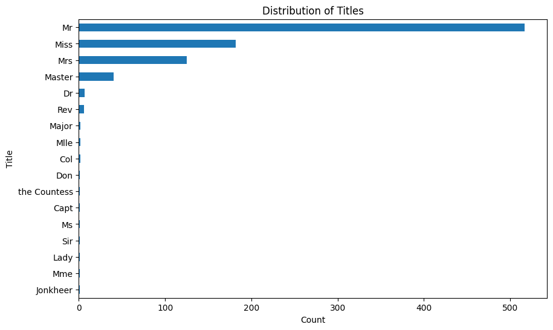
    


From the bar chart above, it is noted that the counts for some titles are quite similar, suggesting that these titles might need to be combined for better clarity and analysis. Hence, the following mapping is applied to reduce the number of unique titles, simplifying the dataset and enhancing the effectiveness of our analysis and modeling. Only Miss, Mrs,Mr and Rare have been kept.


```python
def get_titles(title):
    if title in ['Mme', 'Ms', 'Lady', 'Dona']:
        return 'Mrs'
    elif title in ['Mlle', 'the Countess']:
        return 'Miss'
    elif title in ['Capt', 'Col', 'Major', 'Dr', 'Rev', 'Jonkheer', 'Don', 'Sir','Master']:
        return 'Rare'
    else:
        return title
```


```python
train_data['Title_Combined'] = train_data['Title'].apply(get_titles)
test_data['Title_Combined'] = test_data['Title'].apply(get_titles)
```


```python

X_train = pd.concat([X_Base_train, train_data[['Title_Combined']]], axis=1)
X_train = pd.get_dummies(X_train, columns=['Title_Combined'], drop_first=False)

X_test = pd.concat([X_Base_test, test_data[['Title_Combined']]], axis=1)
X_test = pd.get_dummies(X_test, columns=['Title_Combined'], drop_first=False)

print("This is the new result with title added:")

benchmark_models, benchmark_result = train_RF(X_train, y_train)

```

    This is the new result with title added:
        mean_test_score  std_test_score  \
    42         0.832897        0.018215   
    83         0.831469        0.013224   
    95         0.831419        0.018694   
    4          0.830070        0.011853   
    20         0.830070        0.014855   
    
                                                   params  rank_test_score  
    42  {'n_estimators': 50, 'min_samples_split': 2, '...                1  
    83  {'n_estimators': 100, 'min_samples_split': 10,...                2  
    95  {'n_estimators': 100, 'min_samples_split': 5, ...                3  
    4   {'n_estimators': 150, 'min_samples_split': 2, ...                4  
    20  {'n_estimators': 150, 'min_samples_split': 5, ...                4  
    

### 👶Age

The survival rate can be related to age, as young children might have a higher chance of being rescued. Let’s explore how age affects the survival rate deeper. 📊


```python
import seaborn as sns
import matplotlib.pyplot as plt

def plot_distribution(col_x,key):
 sns.kdeplot(data=train_data[train_data[key] == 1], x=col_x, label='Survived', color='green', fill=True)
 sns.kdeplot(data=train_data[train_data[key] == 0], x=col_x, label='Not Survived', color='red', fill=True)

 plt.xlabel(col_x)
 plt.ylabel('Density')
 plt.title(f'Density Plot of {col_x} by {key}')
 plt.legend()

 plt.show()
```


```python
plot_distribution('Age','Survived')
```


    
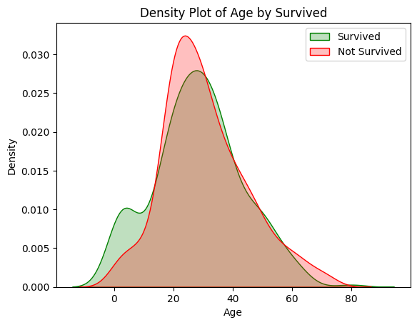
    


From the diagram above, we observe that children and young people under 16 have a higher survival rate, while those between 20 and 30 years old generally have a lower survival rate. 📉 To better analyze this, we’ll categorize the age data into several bins: ['0-16', '16-20', '20-30', '30-40', '40-60', '60-100'].

Before we proceed with binning, we need to address missing values in the age column. 🛠️ We will fill these missing values with the average age of the title group to which the passenger belongs. This approach ensures that the missing data is handled in a way that maintains consistency within each title group.


```python
title_age_median_train = train_data.groupby('Title')['Age'].median()
title_age_median_test = test_data.groupby('Title')['Age'].median()

X_train['Age'] = train_data.apply(
    lambda row: title_age_median_train[row['Title']] if pd.isnull(row['Age']) else row['Age'], axis=1
)

X_test['Age'] = test_data.apply(
    lambda row: title_age_median_test[row['Title']] if pd.isnull(row['Age']) else row['Age'], axis=1
)

```


```python
bins_age = [0, 16,20,30,40,60,100] 
labels_age = ['0-16','16-20','20-30','30-40', '40-60','60-100']
X_train['Age_Category'] = pd.cut(X_train['Age'], bins=bins_age, labels=labels_age, right=True)
X_test['Age_Category'] = pd.cut(X_test['Age'], bins=bins_age, labels=labels_age, right=True)
```


```python
X_train = pd.get_dummies(X_train, columns=['Age_Category'], drop_first=False)
X_test = pd.get_dummies(X_test, columns=['Age_Category'], drop_first=False)
```


```python
X_train.drop('Age',axis=1,inplace=True)
X_test.drop('Age',axis=1,inplace=True)
```

### 💵 Fare


```python
X_test['Fare'].fillna(test_data['Fare'].mean(), inplace=True)
```


```python
X_train['Fare'].plot(kind='hist', bins=100, edgecolor='black')
plt.xlabel('Values')
plt.ylabel('Frequency')
plt.title('Histogram of Values')
plt.show()
```


    
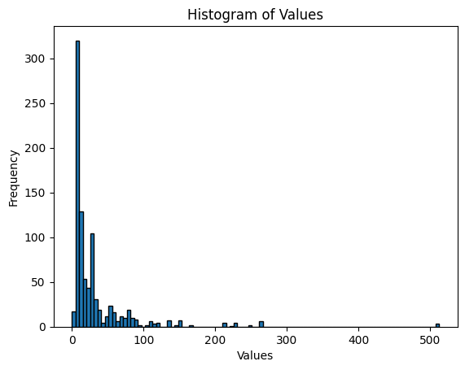
    


```python
plot_distribution('Fare','Survived')
```


    
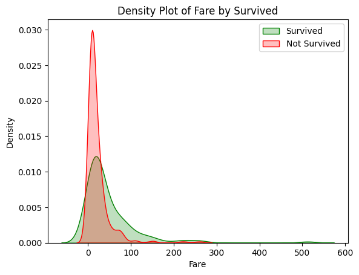
    


From the distribution above, we observe that tickets with a fare above 50 generally have a higher survival rate. To reflect this observation, we’ll divide the fare into the following groups:


```python
bins_fare = [0, 10,50, 100, 200,600]
labels_fare = ['0-10','10-50', '50-100','100-200','200+']

X_train['Fare_bin'] = pd.cut(train_data['Fare'], bins=bins_fare, labels=labels_fare, right=False)
X_test['Fare_bin'] = pd.cut(train_data['Fare'], bins=bins_fare, labels=labels_fare, right=False)

```


```python
X_train = pd.get_dummies(X_train, columns=['Fare_bin'], drop_first=False)
X_test = pd.get_dummies(X_test, columns=['Fare_bin'], drop_first=False)
```


```python
X_train.drop('Fare',axis=1,inplace=True)
X_test.drop('Fare',axis=1,inplace=True)
```

### 🛏️ Cabin

In the training set, only 204 rows contain cabin information. To incorporate this into our analysis, we first create a 'Cabin Indicator' to denote whether cabin information is available. Next, we add a new column, 'Deck', by extracting the first letter from the Cabin column. This letter may have an impact on the survival rate and could provide valuable insights.


```python
X_train['Cabin_ind'] = train_data['Cabin'].apply(lambda x: 0 if pd.isna(x) else 1)
X_test['Cabin_ind'] = test_data['Cabin'].apply(lambda x: 0 if pd.isna(x) else 1)
```


```python
train_data['Deck'] = train_data['Cabin'].apply(lambda x: str(x)[0] if pd.notna(x) else 'M')  # 'M' for Missing
test_data['Deck'] = test_data['Cabin'].apply(lambda x: str(x)[0] if pd.notna(x) else 'M')
```


```python
sns.barplot(x='Deck', y='Survived', data=train_data,palette='pastel')
plt.title('Survival Rate by Deck')
plt.show()
```


    
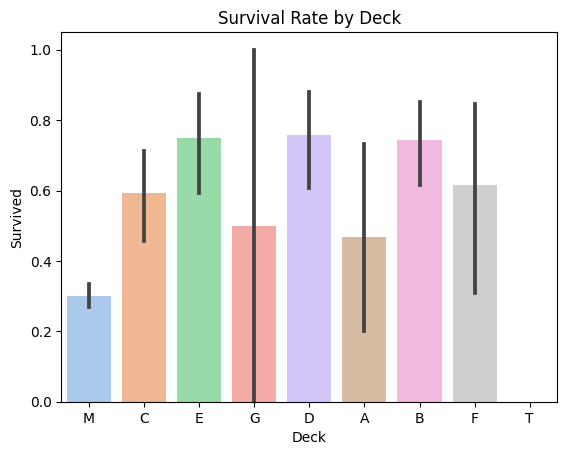
    


From above, we notice that in certain decks the survival rate is relatively higher than the others. Thus, we include this as a new column in our training feature.


```python
X_train['Deck'] = train_data['Deck']
X_test['Deck'] = test_data['Deck']
```


```python
X_train = pd.get_dummies(X_train, columns=['Deck'], drop_first=False)
X_test = pd.get_dummies(X_test, columns=['Deck'], drop_first=False)
```


```python
X_train.info()
X_test.info()
```

    <class 'pandas.core.frame.DataFrame'>
    RangeIndex: 891 entries, 0 to 890
    Data columns (total 33 columns):
     #   Column               Non-Null Count  Dtype
    ---  ------               --------------  -----
     0   Pclass               891 non-null    int64
     1   SibSp                891 non-null    int64
     2   Parch                891 non-null    int64
     3   Sex_female           891 non-null    uint8
     4   Sex_male             891 non-null    uint8
     5   Embarked_C           891 non-null    uint8
     6   Embarked_Q           891 non-null    uint8
     7   Embarked_S           891 non-null    uint8
     8   Title_Combined_Miss  891 non-null    uint8
     9   Title_Combined_Mr    891 non-null    uint8
     10  Title_Combined_Mrs   891 non-null    uint8
     11  Title_Combined_Rare  891 non-null    uint8
     12  Age_Category_0-16    891 non-null    uint8
     13  Age_Category_16-20   891 non-null    uint8
     14  Age_Category_20-30   891 non-null    uint8
     15  Age_Category_30-40   891 non-null    uint8
     16  Age_Category_40-60   891 non-null    uint8
     17  Age_Category_60-100  891 non-null    uint8
     18  Fare_bin_0-10        891 non-null    uint8
     19  Fare_bin_10-50       891 non-null    uint8
     20  Fare_bin_50-100      891 non-null    uint8
     21  Fare_bin_100-200     891 non-null    uint8
     22  Fare_bin_200+        891 non-null    uint8
     23  Cabin_ind            891 non-null    int64
     24  Deck_A               891 non-null    uint8
     25  Deck_B               891 non-null    uint8
     26  Deck_C               891 non-null    uint8
     27  Deck_D               891 non-null    uint8
     28  Deck_E               891 non-null    uint8
     29  Deck_F               891 non-null    uint8
     30  Deck_G               891 non-null    uint8
     31  Deck_M               891 non-null    uint8
     32  Deck_T               891 non-null    uint8
    dtypes: int64(4), uint8(29)
    memory usage: 53.2 KB
    <class 'pandas.core.frame.DataFrame'>
    RangeIndex: 418 entries, 0 to 417
    Data columns (total 32 columns):
     #   Column               Non-Null Count  Dtype
    ---  ------               --------------  -----
     0   Pclass               418 non-null    int64
     1   SibSp                418 non-null    int64
     2   Parch                418 non-null    int64
     3   Sex_female           418 non-null    uint8
     4   Sex_male             418 non-null    uint8
     5   Embarked_C           418 non-null    uint8
     6   Embarked_Q           418 non-null    uint8
     7   Embarked_S           418 non-null    uint8
     8   Title_Combined_Miss  418 non-null    uint8
     9   Title_Combined_Mr    418 non-null    uint8
     10  Title_Combined_Mrs   418 non-null    uint8
     11  Title_Combined_Rare  418 non-null    uint8
     12  Age_Category_0-16    418 non-null    uint8
     13  Age_Category_16-20   418 non-null    uint8
     14  Age_Category_20-30   418 non-null    uint8
     15  Age_Category_30-40   418 non-null    uint8
     16  Age_Category_40-60   418 non-null    uint8
     17  Age_Category_60-100  418 non-null    uint8
     18  Fare_bin_0-10        418 non-null    uint8
     19  Fare_bin_10-50       418 non-null    uint8
     20  Fare_bin_50-100      418 non-null    uint8
     21  Fare_bin_100-200     418 non-null    uint8
     22  Fare_bin_200+        418 non-null    uint8
     23  Cabin_ind            418 non-null    int64
     24  Deck_A               418 non-null    uint8
     25  Deck_B               418 non-null    uint8
     26  Deck_C               418 non-null    uint8
     27  Deck_D               418 non-null    uint8
     28  Deck_E               418 non-null    uint8
     29  Deck_F               418 non-null    uint8
     30  Deck_G               418 non-null    uint8
     31  Deck_M               418 non-null    uint8
    dtypes: int64(4), uint8(28)
    memory usage: 24.6 KB
    

### 🎫 Passenger Class

The survival rate is also associated with the class of the passenger. Generally, first-class passengers have a higher survival rate, followed by second-class passengers. The challenge is deciding whether to include this feature as a dummy variable or as a continuous value. To address this, we will test both approaches to determine which provides better results.


```python
sns.barplot(x='Pclass', y='Survived', data=train_data,palette='pastel')
plt.title('Survival Rate by Pclass')
plt.show()
```


    
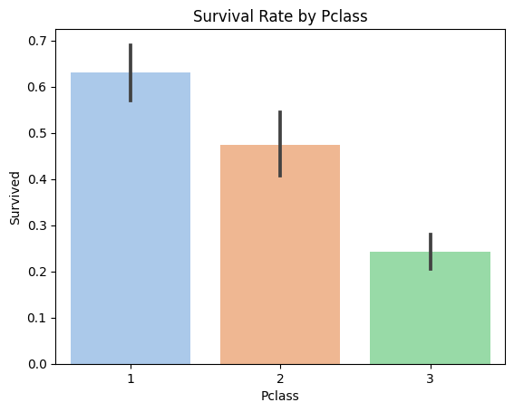
    


```python
X_train_Pclass_dm = pd.get_dummies(X_train, columns=['Pclass'], drop_first=False)
X_test_Pclass_dm = pd.get_dummies(X_test, columns=['Pclass'], drop_first=False)
```


```python
print("P_class as continous variables:")

P_class_models, P_class_result = train_RF(X_train, y_train)

print("P_class as dummy variables:")

P_class_models, P_class_result = train_RF(X_train_Pclass_dm, y_train)
```

    P_class as continous variables:
        mean_test_score  std_test_score  \
    12         0.835664        0.011555   
    31         0.832847        0.013106   
    42         0.831469        0.018233   
    4          0.831459        0.012567   
    10         0.831449        0.018444   
    
                                                   params  rank_test_score  
    12  {'n_estimators': 150, 'min_samples_split': 2, ...                1  
    31  {'n_estimators': 50, 'min_samples_split': 2, '...                2  
    42  {'n_estimators': 50, 'min_samples_split': 2, '...                3  
    4   {'n_estimators': 150, 'min_samples_split': 2, ...                4  
    10  {'n_estimators': 50, 'min_samples_split': 10, ...                5  
    P_class as dummy variables:
        mean_test_score  std_test_score  \
    35         0.832857        0.015754   
    33         0.827253        0.010412   
    26         0.827233        0.010730   
    25         0.827233        0.009762   
    47         0.827233        0.015868   
    
                                                   params  rank_test_score  
    35  {'n_estimators': 50, 'min_samples_split': 5, '...                1  
    33  {'n_estimators': 150, 'min_samples_split': 10,...                2  
    26  {'n_estimators': 50, 'min_samples_split': 5, '...                3  
    25  {'n_estimators': 150, 'min_samples_split': 5, ...                3  
    47  {'n_estimators': 100, 'min_samples_split': 2, ...                3  
    

From the training result, we see that having Pclass has dummy variables might benefit our prediction better.


```python
X_train=X_train_Pclass_dm
X_test=X_test_Pclass_dm
```

### 👨‍👩‍👧‍👦 Family and Connections
Next, we focus on the features Parch (parents/children aboard) and SibSp (siblings/spouses aboard). These features provide insights into family connections, which could influence survival chances.


```python
# Plot survival rate by SibSp
sns.barplot(x='SibSp', y='Survived', data=train_data,palette='pastel')
plt.title('Survival Rate by SibSp')
plt.show()
```


    
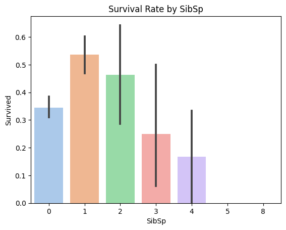
    


```python
# Plot survival rate by Parch
sns.barplot(x='Parch', y='Survived', data=train_data,palette='pastel')
plt.title('Survival Rate by Parch')
plt.show()
```


    
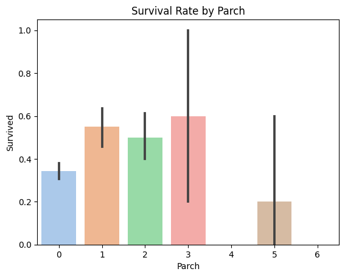
    


It is hard to conclude whether having more relatives/friends on board will lead to higher survival rate. To Explore deeper in this part. Several other features have been created:

**Family Size: where the feature of SibSp and Parch's values have been added together to identify the family size**
****


```python
train_data['Family_size'] = train_data['SibSp'] + train_data['Parch'] 
test_data['Family_size'] = test_data['SibSp'] + test_data['Parch']
```


```python
# Plot survival rate by Family Size
sns.barplot(x='Family_size', y='Survived', data=train_data,palette='pastel')
plt.title('Survival Rate by Family_size')
plt.show()
```


    
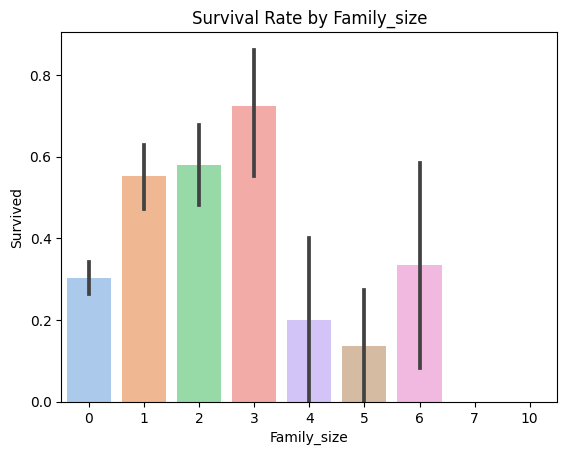
    


We observe that the survival rate increases as family size grows, up to a family size of 3. However, for families with 4 to 5 members, the survival rate tends to decrease. The survival rate improves for families with 6 or more members, though the variance within this group can be quite high.

To simplify the analysis, we group these family sizes into categories as follows:


```python
bins_Familysize = [0,1,3,5,10]
labels_Familysize = ['solo', 'Small','Medium','Large']

X_train['Familysize_Group'] = pd.cut(train_data['Family_size'], bins=bins_Familysize, labels=labels_Familysize , right=False)
X_test['Familysize_Group'] = pd.cut(test_data['Family_size'], bins=bins_Familysize, labels=labels_Familysize , right=False)

```


```python
X_train = pd.get_dummies(X_train, columns=['Familysize_Group'], drop_first=False)
X_test = pd.get_dummies(X_test, columns=['Familysize_Group'], drop_first=False)
```

After adding the new feature, we need to decide whether to keep the original Parch and SibSp features. To determine which features to include, we will build and test the following models. 


```python
ParchSibSp_asDm_X_train=pd.get_dummies(X_train, columns=['Parch','SibSp'], drop_first=False)
ParchSibSp_asDm_X_test=pd.get_dummies(X_test, columns=['Parch','SibSp'], drop_first=False)
```


```python
NoFamilysize_X_train=X_train.drop(columns=['Familysize_Group_Small','Familysize_Group_Medium','Familysize_Group_Large'])
NoFamilysize_X_test=X_test.drop(columns=['Familysize_Group_Small','Familysize_Group_Medium','Familysize_Group_Large'])
```


```python
NoParchSibSp_X_train=X_train.drop(columns=['Parch','SibSp'])
NoParchSibSp_X_test=X_test.drop(columns=['Parch','SibSp'])
```


```python
print("Keep Family_size and Parch/SibSp:")

Family_AllIncluded, result = train_RF(X_train, y_train)

print("Keep Family_size and Parch/SibSp as dummies:")

Family_AllIncludeddm, result = train_RF(ParchSibSp_asDm_X_train, y_train)

print("No family size:")

NoFamilysize_Included, result = train_RF(NoFamilysize_X_train, y_train)

print("No Parents/Siblings info:")
NoParchsib_Included,result = train_RF(NoParchSibSp_X_train, y_train)

```

    Keep Family_size and Parch/SibSp:
        mean_test_score  std_test_score  \
    17         0.831459        0.012600   
    45         0.831429        0.018083   
    34         0.831419        0.018155   
    61         0.831419        0.021181   
    96         0.830021        0.023951   
    
                                                   params  rank_test_score  
    17  {'n_estimators': 50, 'min_samples_split': 2, '...                1  
    45  {'n_estimators': 50, 'min_samples_split': 5, '...                2  
    34  {'n_estimators': 100, 'min_samples_split': 5, ...                3  
    61  {'n_estimators': 100, 'min_samples_split': 2, ...                3  
    96  {'n_estimators': 100, 'min_samples_split': 10,...                5  
    Keep Family_size and Parch/SibSp as dummies:
        mean_test_score  std_test_score  \
    59         0.827214        0.014859   
    44         0.825835        0.012211   
    24         0.825835        0.009466   
    81         0.825805        0.016653   
    11         0.825805        0.018331   
    
                                                   params  rank_test_score  
    59  {'n_estimators': 150, 'min_samples_split': 10,...                1  
    44  {'n_estimators': 100, 'min_samples_split': 2, ...                2  
    24  {'n_estimators': 50, 'min_samples_split': 10, ...                2  
    81  {'n_estimators': 100, 'min_samples_split': 10,...                4  
    11  {'n_estimators': 100, 'min_samples_split': 10,...                4  
    No family size:
        mean_test_score  std_test_score  \
    76         0.830031        0.015301   
    70         0.828632        0.009868   
    71         0.827233        0.009777   
    7          0.827223        0.018350   
    83         0.825845        0.014995   
    
                                                   params  rank_test_score  
    76  {'n_estimators': 150, 'min_samples_split': 5, ...                1  
    70  {'n_estimators': 150, 'min_samples_split': 10,...                2  
    71  {'n_estimators': 100, 'min_samples_split': 10,...                3  
    7   {'n_estimators': 100, 'min_samples_split': 5, ...                4  
    83  {'n_estimators': 100, 'min_samples_split': 10,...                5  
    No Parents/Siblings info:
        mean_test_score  std_test_score  \
    11         0.828602        0.024130   
    26         0.825835        0.019122   
    77         0.825825        0.015216   
    66         0.825815        0.017711   
    13         0.825795        0.025627   
    
                                                   params  rank_test_score  
    11  {'n_estimators': 100, 'min_samples_split': 10,...                1  
    26  {'n_estimators': 50, 'min_samples_split': 5, '...                2  
    77  {'n_estimators': 100, 'min_samples_split': 5, ...                3  
    66  {'n_estimators': 100, 'min_samples_split': 10,...                4  
    13  {'n_estimators': 150, 'min_samples_split': 5, ...                5  
    

From the results, we see that adding the Family Size feature provides additional impact beyond what is captured by Parch and SibSp. This suggests that the new feature offers valuable information that enhances the model's predictive power.


```python

```

### 👩‍👧‍👦  Is Mother or not

A new variable is created to identify whether a passenger is a mother, based on her title and the Parch feature. 👩‍👧‍👦 This helps capture specific familial relationships that may influence survival chances.


```python
def is_mother(row):
    return row['Title'] == 'Mrs' and row['Parch'] > 0

# Apply the function to create the 'Is_Mother' column
train_data['Is_Mother'] = train_data.apply(is_mother, axis=1).astype(int)
test_data['Is_Mother'] = test_data.apply(is_mother, axis=1).astype(int)

```


```python
sns.barplot(x='Is_Mother', y='Survived', data=train_data,palette='pastel')
plt.title('Survival Rate by Parch')
plt.show()
```


    
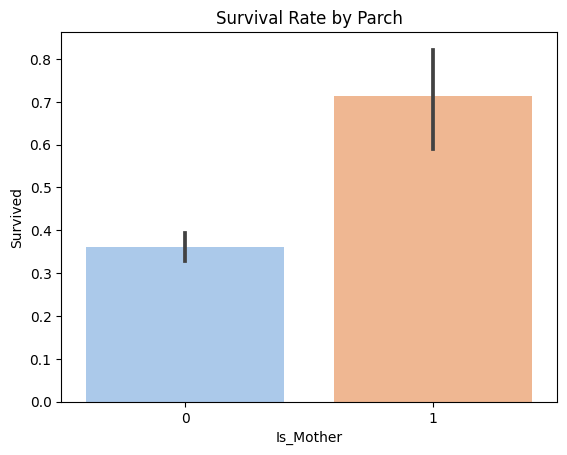
    


From the bar chart, we can clearly see that mothers have a higher survival rate. Therefore, this new variable has been added to the training features to our training features.


```python
X_train = pd.concat([X_train, train_data[['Is_Mother']]], axis=1)
X_test = pd.concat([X_test, test_data[['Is_Mother']]], axis=1)
```

### 🧩Ticket Number


```python
train_data['Ticket'].describe()
```


    count        891
    unique       681
    top       347082
    freq           7
    Name: Ticket, dtype: object


Interpreting ticket numbers can be challenging at first glance. However, from the data exploration it is not hard to find out that some passengers share the same ticket number.This suggests that they might have similar survival outcomes. To capture this potential connection, we create a new variable called 'Connected Survival':

For tickets shared by multiple passengers, the following code calculates the average survival rate and assigns a Connected_Survival value of 1 or 0 based on whether the average survival rate within the group is above or below 0.5. This new variable helps in capturing potential survival connections among passengers with the same ticket(across training and test set!).


```python
combined_data = pd.concat([train_data, test_data], axis=0, ignore_index=True)
combined_data['Is_Duplicate_Ticket'] = combined_data.duplicated(subset=['Ticket'], keep=False)
combined_data['Connected_Survival'] = 0.5 #We give a 0.5 survival rate to all passengers first.

for ticket, ticket_gp in combined_data.groupby('Ticket'):
    if len(ticket_gp) > 1:  # Only consider tickets with more than one passenger
        smean = ticket_gp['Survived'].mean()
        for ind, row in ticket_gp.iterrows():  # if the majority in the group survived, we assign connected survival= 1 to all the passengers share the ticket. 
            passID = row['PassengerId']
            if smean >= 0.5:
                combined_data.loc[combined_data['PassengerId'] == passID, 'Connected_Survival'] = 1
            elif smean < 0.5:
                combined_data.loc[combined_data['PassengerId'] == passID, 'Connected_Survival'] = 0
    
```


```python
train_data['Connected_Survival'] = combined_data['Connected_Survival'].iloc[:len(train_data)]
test_data['Connected_Survival'] = combined_data['Connected_Survival'].iloc[len(train_data):].reset_index(drop=True)
```


```python
X_with_cs= pd.concat([X_train, train_data[['Connected_Survival']]], axis=1)
```


```python
print("With Connected Survival:")

X_cs_models, C_result = train_RF(X_with_cs, y_train)

print("Without Connected Survival:")

X_wcs_models, C_result = train_RF(X_train, y_train)
```

    With Connected Survival:
        mean_test_score  std_test_score  \
    84         0.862366        0.021120   
    10         0.862356        0.018704   
    50         0.862346        0.016519   
    11         0.862346        0.016519   
    35         0.860967        0.020511   
    
                                                   params  rank_test_score  
    84  {'n_estimators': 50, 'min_samples_split': 10, ...                1  
    10  {'n_estimators': 50, 'min_samples_split': 10, ...                2  
    50  {'n_estimators': 50, 'min_samples_split': 5, '...                3  
    11  {'n_estimators': 100, 'min_samples_split': 10,...                3  
    35  {'n_estimators': 50, 'min_samples_split': 5, '...                5  
    Without Connected Survival:
        mean_test_score  std_test_score  \
    84         0.830001        0.022368   
    28         0.827214        0.024442   
    18         0.827204        0.023260   
    99         0.825845        0.020552   
    24         0.825835        0.012211   
    
                                                   params  rank_test_score  
    84  {'n_estimators': 50, 'min_samples_split': 10, ...                1  
    28  {'n_estimators': 150, 'min_samples_split': 5, ...                2  
    18  {'n_estimators': 150, 'min_samples_split': 5, ...                3  
    99  {'n_estimators': 50, 'min_samples_split': 10, ...                4  
    24  {'n_estimators': 50, 'min_samples_split': 10, ...                5  
    

This is a BIG JUMP! So we include this new feature into our model:


```python
X_train['Connected_Survival'] = combined_data['Connected_Survival'].iloc[:len(train_data)]
X_test['Connected_Survival'] = combined_data['Connected_Survival'].iloc[len(train_data):].reset_index(drop=True)
```

### 📊 Finalising Training Set and Test Set

The final set is to verify that both the training and test datasets have the same number of columns. If there are missing columns(happens when creating dummy varaibles), we need to adjust the columns to make them compatible. This step is crucial for preparing the data to be fitted into the model later on.


```python
train_columns = set(X_train.columns)
test_columns = set(X_test.columns)
```


```python
missing_cols_test = train_columns - test_columns
```


```python
missing_cols_test
```


    {'Deck_T'}


```python
for col in missing_cols_test:
    X_test[col] = 0
```


```python
X_test = X_test[X_train.columns]
```


```python
X_test.columns
```


    Index(['SibSp', 'Parch', 'Sex_female', 'Sex_male', 'Embarked_C', 'Embarked_Q',
           'Embarked_S', 'Title_Combined_Miss', 'Title_Combined_Mr',
           'Title_Combined_Mrs', 'Title_Combined_Rare', 'Age_Category_0-16',
           'Age_Category_16-20', 'Age_Category_20-30', 'Age_Category_30-40',
           'Age_Category_40-60', 'Age_Category_60-100', 'Fare_bin_0-10',
           'Fare_bin_10-50', 'Fare_bin_50-100', 'Fare_bin_100-200',
           'Fare_bin_200+', 'Cabin_ind', 'Deck_A', 'Deck_B', 'Deck_C', 'Deck_D',
           'Deck_E', 'Deck_F', 'Deck_G', 'Deck_M', 'Deck_T', 'Pclass_1',
           'Pclass_2', 'Pclass_3', 'Familysize_Group_solo',
           'Familysize_Group_Small', 'Familysize_Group_Medium',
           'Familysize_Group_Large', 'Is_Mother', 'Connected_Survival'],
          dtype='object')


```python
X_train.columns
```


    Index(['SibSp', 'Parch', 'Sex_female', 'Sex_male', 'Embarked_C', 'Embarked_Q',
           'Embarked_S', 'Title_Combined_Miss', 'Title_Combined_Mr',
           'Title_Combined_Mrs', 'Title_Combined_Rare', 'Age_Category_0-16',
           'Age_Category_16-20', 'Age_Category_20-30', 'Age_Category_30-40',
           'Age_Category_40-60', 'Age_Category_60-100', 'Fare_bin_0-10',
           'Fare_bin_10-50', 'Fare_bin_50-100', 'Fare_bin_100-200',
           'Fare_bin_200+', 'Cabin_ind', 'Deck_A', 'Deck_B', 'Deck_C', 'Deck_D',
           'Deck_E', 'Deck_F', 'Deck_G', 'Deck_M', 'Deck_T', 'Pclass_1',
           'Pclass_2', 'Pclass_3', 'Familysize_Group_solo',
           'Familysize_Group_Small', 'Familysize_Group_Medium',
           'Familysize_Group_Large', 'Is_Mother', 'Connected_Survival'],
          dtype='object')


Now, both of them have same numbers of columns and is ready for the training stage.


```python

```

## 🤖 Model Construction: Training Random Forest

This piece of code below is prepared for the previous feature engineering section:


```python
def train_RF(X_train,y_train):

    X_train_split, X_val, y_train_split, y_val = train_test_split(X_train, y_train, test_size=0.2, random_state=42)
    
    param_grid = {
        'n_estimators': [50, 100, 150],
        'max_depth': [None, 5, 10, 15],
        'max_features': ['sqrt', 'log2'],
        'min_samples_split': [2, 5, 10],
        'min_samples_leaf': [1, 2, 4],
        'bootstrap': [True, False]
    }
    
    randomized_search = RandomizedSearchCV(
        estimator=RandomForestClassifier(random_state=44),
        param_distributions=param_grid,
        n_iter=100,  # Number of parameter settings sampled
        n_jobs=-1,
        scoring='accuracy',
        random_state=44,
        cv=5
        )

    randomized_search.fit(X_train_split, y_train_split)
    results = randomized_search.cv_results_

    results_df = pd.DataFrame({
        'mean_test_score': results['mean_test_score'],
        'std_test_score': results['std_test_score'],
        'params': results['params'],
        'rank_test_score': results['rank_test_score']
        })
    sorted_results_df = results_df.sort_values(by='rank_test_score')
    top_5_results = sorted_results_df.head(5)

    # Initialize an empty list to store the top models
    top_models = []
    result=[]
    # Loop through the top 5 results and build models using those parameters
    for idx, row in top_5_results.iterrows():
        params = row['params']
        model = RandomForestClassifier(**params)
        model.fit(X_train_split, y_train_split) 
        top_models.append(model)
        scores = cross_val_score(model, X_train_split, y_train_split, cv=5, scoring='accuracy')  # 5-fold cross-validation
        mean_accuracy = np.mean(scores)
        std_accuracy = np.std(scores)
        result.append((mean_accuracy,std_accuracy))
    print(sorted_results_df.head(5))
    return(top_models,result)

```

In the final modelling part, we increase our search grid and iteration numbers in order to find the best fit.


```python
param_grid = {
    'n_estimators': [25, 50, 75, 100, 150,125],           # Number of trees in the forest
    'max_depth': [5, 6, 7, 8, 9, 10],                # Maximum depth of the tree
    'max_features': ['sqrt', 'log2'],        # Number of features to consider for the best split
    'min_samples_split': [2, 5, 10],                 # Minimum number of samples required to split an internal node
    'min_samples_leaf': [1, 2, 4,8],                   # Minimum number of samples required to be at a leaf node
    'bootstrap': [True, False]                       # Whether bootstrap samples are used when building trees
}
```


```python
X_train_split, X_val, y_train_split, y_val = train_test_split(X_train, y_train, test_size=0.2, random_state=42)
```


```python
randomized_search = RandomizedSearchCV(
    estimator=RandomForestClassifier(random_state=44),
    param_distributions=param_grid,
    n_iter=1000, 
    n_jobs=-1,
    scoring='accuracy',
    random_state=44
)

randomized_search.fit(X_train_split, y_train_split)
```


<style>#sk-container-id-1 {color: black;background-color: white;}#sk-container-id-1 pre{padding: 0;}#sk-container-id-1 div.sk-toggleable {background-color: white;}#sk-container-id-1 label.sk-toggleable__label {cursor: pointer;display: block;width: 100%;margin-bottom: 0;padding: 0.3em;box-sizing: border-box;text-align: center;}#sk-container-id-1 label.sk-toggleable__label-arrow:before {content: "▸";float: left;margin-right: 0.25em;color: #696969;}#sk-container-id-1 label.sk-toggleable__label-arrow:hover:before {color: black;}#sk-container-id-1 div.sk-estimator:hover label.sk-toggleable__label-arrow:before {color: black;}#sk-container-id-1 div.sk-toggleable__content {max-height: 0;max-width: 0;overflow: hidden;text-align: left;background-color: #f0f8ff;}#sk-container-id-1 div.sk-toggleable__content pre {margin: 0.2em;color: black;border-radius: 0.25em;background-color: #f0f8ff;}#sk-container-id-1 input.sk-toggleable__control:checked~div.sk-toggleable__content {max-height: 200px;max-width: 100%;overflow: auto;}#sk-container-id-1 input.sk-toggleable__control:checked~label.sk-toggleable__label-arrow:before {content: "▾";}#sk-container-id-1 div.sk-estimator input.sk-toggleable__control:checked~label.sk-toggleable__label {background-color: #d4ebff;}#sk-container-id-1 div.sk-label input.sk-toggleable__control:checked~label.sk-toggleable__label {background-color: #d4ebff;}#sk-container-id-1 input.sk-hidden--visually {border: 0;clip: rect(1px 1px 1px 1px);clip: rect(1px, 1px, 1px, 1px);height: 1px;margin: -1px;overflow: hidden;padding: 0;position: absolute;width: 1px;}#sk-container-id-1 div.sk-estimator {font-family: monospace;background-color: #f0f8ff;border: 1px dotted black;border-radius: 0.25em;box-sizing: border-box;margin-bottom: 0.5em;}#sk-container-id-1 div.sk-estimator:hover {background-color: #d4ebff;}#sk-container-id-1 div.sk-parallel-item::after {content: "";width: 100%;border-bottom: 1px solid gray;flex-grow: 1;}#sk-container-id-1 div.sk-label:hover label.sk-toggleable__label {background-color: #d4ebff;}#sk-container-id-1 div.sk-serial::before {content: "";position: absolute;border-left: 1px solid gray;box-sizing: border-box;top: 0;bottom: 0;left: 50%;z-index: 0;}#sk-container-id-1 div.sk-serial {display: flex;flex-direction: column;align-items: center;background-color: white;padding-right: 0.2em;padding-left: 0.2em;position: relative;}#sk-container-id-1 div.sk-item {position: relative;z-index: 1;}#sk-container-id-1 div.sk-parallel {display: flex;align-items: stretch;justify-content: center;background-color: white;position: relative;}#sk-container-id-1 div.sk-item::before, #sk-container-id-1 div.sk-parallel-item::before {content: "";position: absolute;border-left: 1px solid gray;box-sizing: border-box;top: 0;bottom: 0;left: 50%;z-index: -1;}#sk-container-id-1 div.sk-parallel-item {display: flex;flex-direction: column;z-index: 1;position: relative;background-color: white;}#sk-container-id-1 div.sk-parallel-item:first-child::after {align-self: flex-end;width: 50%;}#sk-container-id-1 div.sk-parallel-item:last-child::after {align-self: flex-start;width: 50%;}#sk-container-id-1 div.sk-parallel-item:only-child::after {width: 0;}#sk-container-id-1 div.sk-dashed-wrapped {border: 1px dashed gray;margin: 0 0.4em 0.5em 0.4em;box-sizing: border-box;padding-bottom: 0.4em;background-color: white;}#sk-container-id-1 div.sk-label label {font-family: monospace;font-weight: bold;display: inline-block;line-height: 1.2em;}#sk-container-id-1 div.sk-label-container {text-align: center;}#sk-container-id-1 div.sk-container {/* jupyter's `normalize.less` sets `[hidden] { display: none; }` but bootstrap.min.css set `[hidden] { display: none !important; }` so we also need the `!important` here to be able to override the default hidden behavior on the sphinx rendered scikit-learn.org. See: https://github.com/scikit-learn/scikit-learn/issues/21755 */display: inline-block !important;position: relative;}#sk-container-id-1 div.sk-text-repr-fallback {display: none;}</style><div id="sk-container-id-1" class="sk-top-container"><div class="sk-text-repr-fallback"><pre>RandomizedSearchCV(estimator=RandomForestClassifier(random_state=44),
                   n_iter=1000, n_jobs=-1,
                   param_distributions={&#x27;bootstrap&#x27;: [True, False],
                                        &#x27;max_depth&#x27;: [5, 6, 7, 8, 9, 10],
                                        &#x27;max_features&#x27;: [&#x27;sqrt&#x27;, &#x27;log2&#x27;],
                                        &#x27;min_samples_leaf&#x27;: [1, 2, 4, 8],
                                        &#x27;min_samples_split&#x27;: [2, 5, 10],
                                        &#x27;n_estimators&#x27;: [25, 50, 75, 100, 150,
                                                         125]},
                   random_state=44, scoring=&#x27;accuracy&#x27;)</pre><b>In a Jupyter environment, please rerun this cell to show the HTML representation or trust the notebook. <br />On GitHub, the HTML representation is unable to render, please try loading this page with nbviewer.org.</b></div><div class="sk-container" hidden><div class="sk-item sk-dashed-wrapped"><div class="sk-label-container"><div class="sk-label sk-toggleable"><input class="sk-toggleable__control sk-hidden--visually" id="sk-estimator-id-1" type="checkbox" ><label for="sk-estimator-id-1" class="sk-toggleable__label sk-toggleable__label-arrow">RandomizedSearchCV</label><div class="sk-toggleable__content"><pre>RandomizedSearchCV(estimator=RandomForestClassifier(random_state=44),
                   n_iter=1000, n_jobs=-1,
                   param_distributions={&#x27;bootstrap&#x27;: [True, False],
                                        &#x27;max_depth&#x27;: [5, 6, 7, 8, 9, 10],
                                        &#x27;max_features&#x27;: [&#x27;sqrt&#x27;, &#x27;log2&#x27;],
                                        &#x27;min_samples_leaf&#x27;: [1, 2, 4, 8],
                                        &#x27;min_samples_split&#x27;: [2, 5, 10],
                                        &#x27;n_estimators&#x27;: [25, 50, 75, 100, 150,
                                                         125]},
                   random_state=44, scoring=&#x27;accuracy&#x27;)</pre></div></div></div><div class="sk-parallel"><div class="sk-parallel-item"><div class="sk-item"><div class="sk-label-container"><div class="sk-label sk-toggleable"><input class="sk-toggleable__control sk-hidden--visually" id="sk-estimator-id-2" type="checkbox" ><label for="sk-estimator-id-2" class="sk-toggleable__label sk-toggleable__label-arrow">estimator: RandomForestClassifier</label><div class="sk-toggleable__content"><pre>RandomForestClassifier(random_state=44)</pre></div></div></div><div class="sk-serial"><div class="sk-item"><div class="sk-estimator sk-toggleable"><input class="sk-toggleable__control sk-hidden--visually" id="sk-estimator-id-3" type="checkbox" ><label for="sk-estimator-id-3" class="sk-toggleable__label sk-toggleable__label-arrow">RandomForestClassifier</label><div class="sk-toggleable__content"><pre>RandomForestClassifier(random_state=44)</pre></div></div></div></div></div></div></div></div></div></div>


```python

results = randomized_search.cv_results_

results_df = pd.DataFrame({
    'mean_test_score': results['mean_test_score'],
    'std_test_score': results['std_test_score'],
    'params': results['params'],
    'rank_test_score': results['rank_test_score']
})

print(results_df.sort_values(by='rank_test_score'))
```

         mean_test_score  std_test_score  \
    864         0.866552        0.016211   
    114         0.866552        0.016211   
    769         0.866552        0.016211   
    58          0.865173        0.019580   
    14          0.865163        0.022888   
    ..               ...             ...   
    252         0.846942        0.018285   
    891         0.846932        0.013384   
    923         0.846912        0.011226   
    946         0.846912        0.014998   
    313         0.846902        0.015747   
    
                                                    params  rank_test_score  
    864  {'n_estimators': 25, 'min_samples_split': 5, '...                1  
    114  {'n_estimators': 25, 'min_samples_split': 2, '...                1  
    769  {'n_estimators': 75, 'min_samples_split': 10, ...                1  
    58   {'n_estimators': 50, 'min_samples_split': 5, '...                4  
    14   {'n_estimators': 25, 'min_samples_split': 5, '...                5  
    ..                                                 ...              ...  
    252  {'n_estimators': 25, 'min_samples_split': 2, '...              995  
    891  {'n_estimators': 100, 'min_samples_split': 2, ...              997  
    923  {'n_estimators': 150, 'min_samples_split': 2, ...              998  
    946  {'n_estimators': 75, 'min_samples_split': 2, '...              999  
    313  {'n_estimators': 25, 'min_samples_split': 2, '...             1000  
    
    [1000 rows x 4 columns]
    

Based on the results from grid search, we select the top ten models that performed best. We then build a voting classifier using these top models. The voting classifier aggregates the predictions from each model, combining their strengths to improve overall performance and robustness. This approach helps in leveraging the collective power of multiple models to make more accurate predictions.


```python
top_10_results = results_df.sort_values(by='rank_test_score').head(10)

# Initialize an empty list to store the top models
top_models = []

# Loop through the top 5 results and build models using those parameters
for idx, row in top_10_results.iterrows():
    params = row['params']
    model = RandomForestClassifier(**params)
    top_models.append(model)
    
print(top_models)
```

    [RandomForestClassifier(bootstrap=False, max_depth=10, max_features='log2',
                           min_samples_leaf=8, min_samples_split=5,
                           n_estimators=25), RandomForestClassifier(bootstrap=False, max_depth=10, max_features='log2',
                           min_samples_leaf=8, n_estimators=25), RandomForestClassifier(max_depth=5, max_features='log2', min_samples_leaf=4,
                           min_samples_split=10, n_estimators=75), RandomForestClassifier(max_depth=5, min_samples_split=5, n_estimators=50), RandomForestClassifier(bootstrap=False, max_depth=8, min_samples_leaf=4,
                           min_samples_split=5, n_estimators=25), RandomForestClassifier(bootstrap=False, max_depth=8, min_samples_leaf=4,
                           n_estimators=25), RandomForestClassifier(max_depth=8, max_features='log2', min_samples_leaf=4,
                           min_samples_split=10), RandomForestClassifier(max_depth=6, max_features='log2', min_samples_leaf=4,
                           min_samples_split=5, n_estimators=25), RandomForestClassifier(max_depth=6, max_features='log2', min_samples_leaf=4,
                           n_estimators=25), RandomForestClassifier(bootstrap=False, max_depth=5, min_samples_leaf=2,
                           min_samples_split=10, n_estimators=25)]
    


```python
for model in top_models:
    model.fit(X_train_split, y_train_split)
```


```python
import matplotlib.pyplot as plt
import seaborn as sns
import pandas as pd

# Get feature names
feature_names = X_train_split.columns

# Plotting feature importances for each model
for i, model in enumerate(top_models):
    importances = model.feature_importances_
    importance_df = pd.DataFrame({
        'feature': feature_names,
        'importance': importances
    })
    importance_df = importance_df.sort_values(by='importance', ascending=False)
    
    # Plot
    plt.figure(figsize=(10, 6))
    sns.barplot(x='importance', y='feature', data=importance_df)
    plt.title(f'Feature Importances for Model {i+1}')
    plt.xlabel('Importance')
    plt.ylabel('Feature')
    plt.show()
```


    
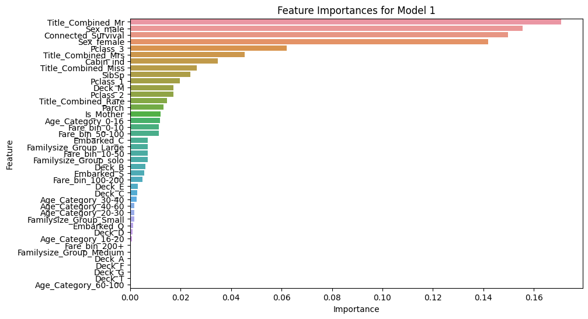
    


    
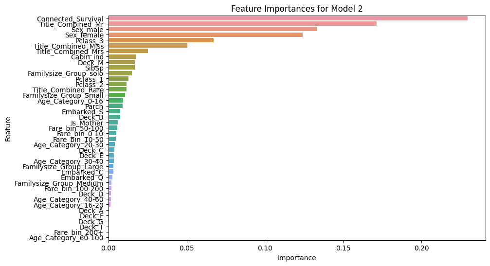
    


    
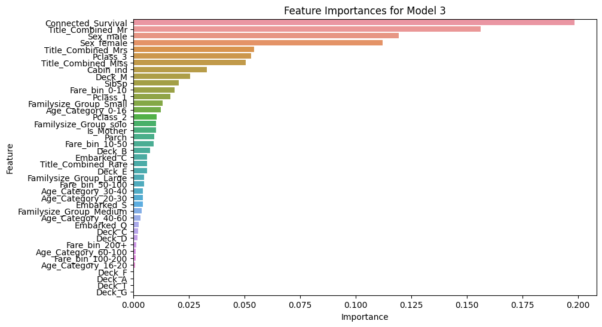
    


    
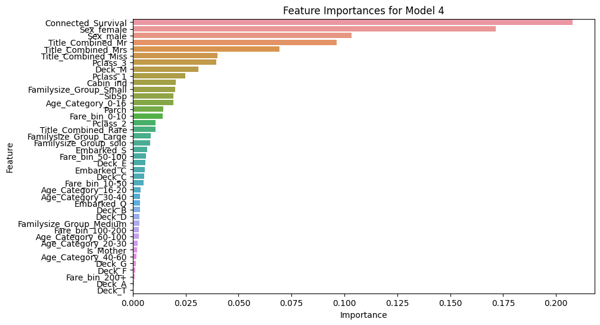
    


    
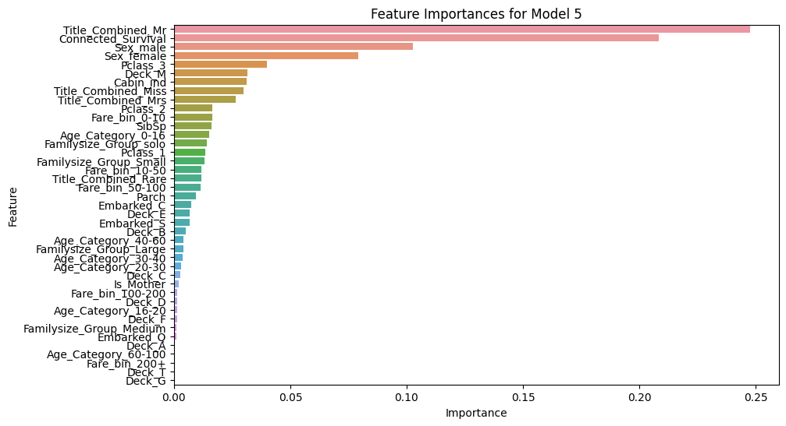
    


    
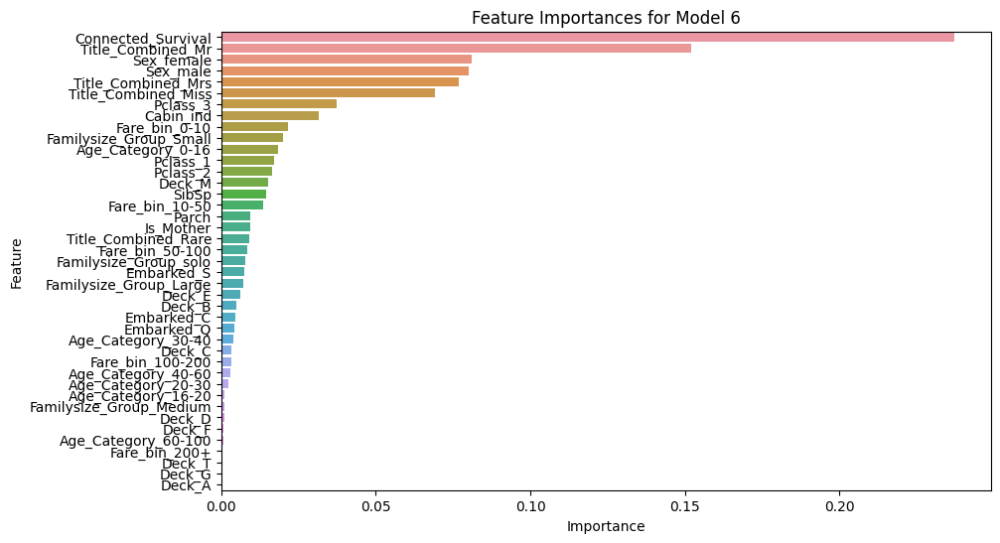
    


    
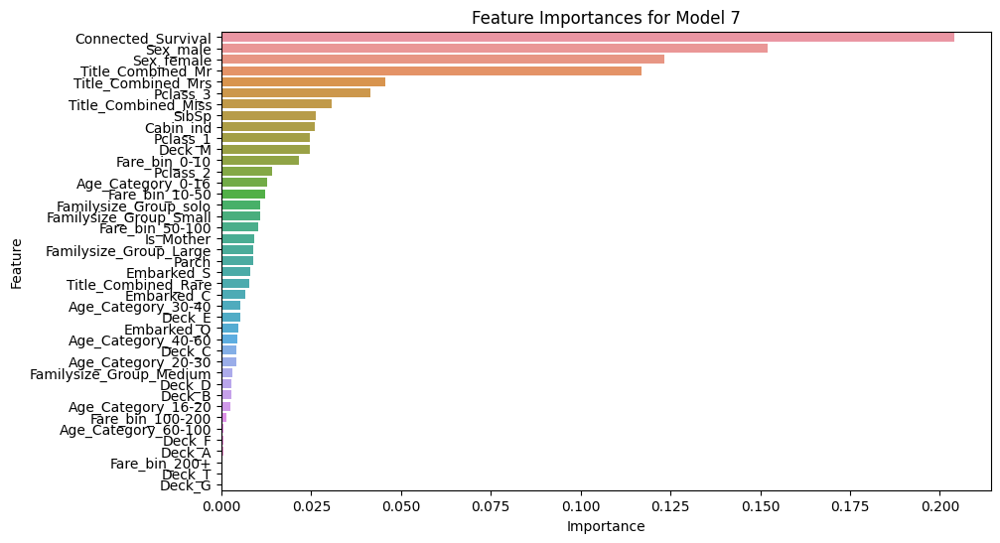
    


    
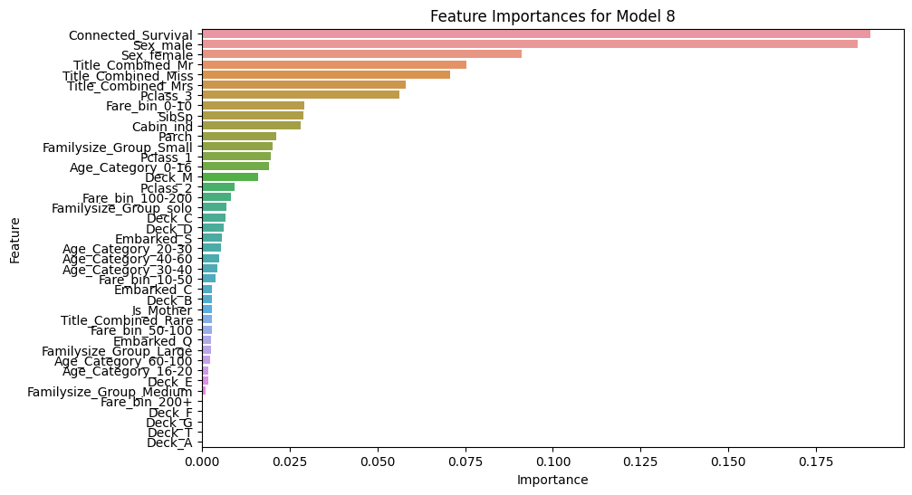
    


    
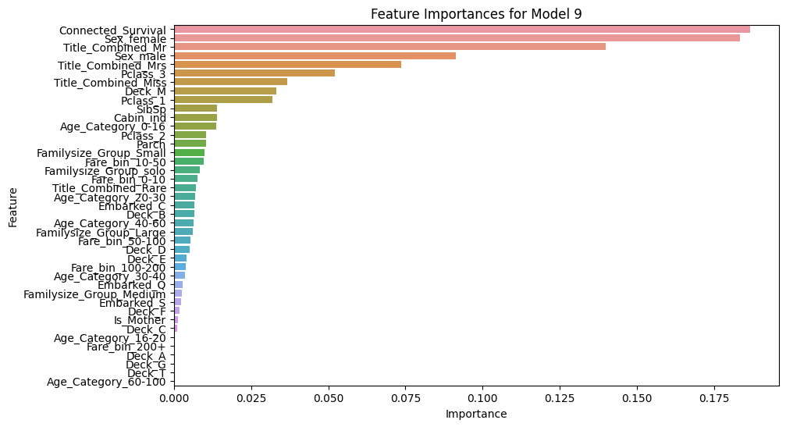
    


    
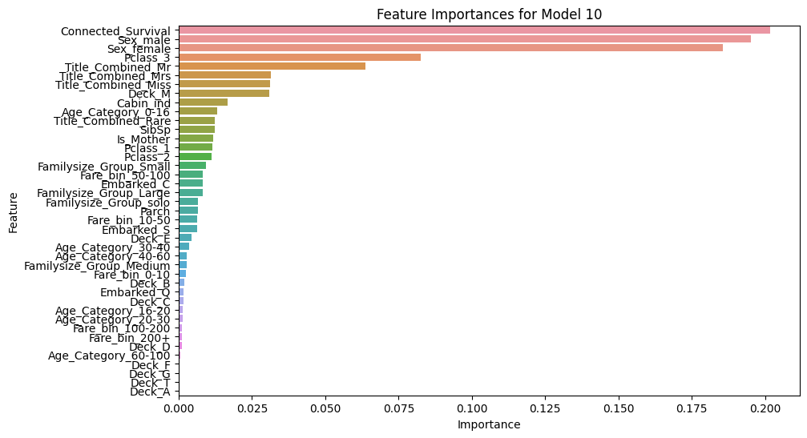
    


From the diagrams above, we observe that the ten Random Forest models have varying feature priorities and selections. This diversity helps in reducing model bias by capturing different aspects of the data. 

Now, we combine these models through a voting classifier helps in balancing out individual model biases:


```python
from sklearn.ensemble import VotingClassifier

model_list = [(f'model_{i+1}', model) for i, model in enumerate(top_models)]
voting_clf = VotingClassifier(estimators=model_list, voting='soft')  
voting_clf.fit(X_train, y_train)

```


<style>#sk-container-id-3 {color: black;background-color: white;}#sk-container-id-3 pre{padding: 0;}#sk-container-id-3 div.sk-toggleable {background-color: white;}#sk-container-id-3 label.sk-toggleable__label {cursor: pointer;display: block;width: 100%;margin-bottom: 0;padding: 0.3em;box-sizing: border-box;text-align: center;}#sk-container-id-3 label.sk-toggleable__label-arrow:before {content: "▸";float: left;margin-right: 0.25em;color: #696969;}#sk-container-id-3 label.sk-toggleable__label-arrow:hover:before {color: black;}#sk-container-id-3 div.sk-estimator:hover label.sk-toggleable__label-arrow:before {color: black;}#sk-container-id-3 div.sk-toggleable__content {max-height: 0;max-width: 0;overflow: hidden;text-align: left;background-color: #f0f8ff;}#sk-container-id-3 div.sk-toggleable__content pre {margin: 0.2em;color: black;border-radius: 0.25em;background-color: #f0f8ff;}#sk-container-id-3 input.sk-toggleable__control:checked~div.sk-toggleable__content {max-height: 200px;max-width: 100%;overflow: auto;}#sk-container-id-3 input.sk-toggleable__control:checked~label.sk-toggleable__label-arrow:before {content: "▾";}#sk-container-id-3 div.sk-estimator input.sk-toggleable__control:checked~label.sk-toggleable__label {background-color: #d4ebff;}#sk-container-id-3 div.sk-label input.sk-toggleable__control:checked~label.sk-toggleable__label {background-color: #d4ebff;}#sk-container-id-3 input.sk-hidden--visually {border: 0;clip: rect(1px 1px 1px 1px);clip: rect(1px, 1px, 1px, 1px);height: 1px;margin: -1px;overflow: hidden;padding: 0;position: absolute;width: 1px;}#sk-container-id-3 div.sk-estimator {font-family: monospace;background-color: #f0f8ff;border: 1px dotted black;border-radius: 0.25em;box-sizing: border-box;margin-bottom: 0.5em;}#sk-container-id-3 div.sk-estimator:hover {background-color: #d4ebff;}#sk-container-id-3 div.sk-parallel-item::after {content: "";width: 100%;border-bottom: 1px solid gray;flex-grow: 1;}#sk-container-id-3 div.sk-label:hover label.sk-toggleable__label {background-color: #d4ebff;}#sk-container-id-3 div.sk-serial::before {content: "";position: absolute;border-left: 1px solid gray;box-sizing: border-box;top: 0;bottom: 0;left: 50%;z-index: 0;}#sk-container-id-3 div.sk-serial {display: flex;flex-direction: column;align-items: center;background-color: white;padding-right: 0.2em;padding-left: 0.2em;position: relative;}#sk-container-id-3 div.sk-item {position: relative;z-index: 1;}#sk-container-id-3 div.sk-parallel {display: flex;align-items: stretch;justify-content: center;background-color: white;position: relative;}#sk-container-id-3 div.sk-item::before, #sk-container-id-3 div.sk-parallel-item::before {content: "";position: absolute;border-left: 1px solid gray;box-sizing: border-box;top: 0;bottom: 0;left: 50%;z-index: -1;}#sk-container-id-3 div.sk-parallel-item {display: flex;flex-direction: column;z-index: 1;position: relative;background-color: white;}#sk-container-id-3 div.sk-parallel-item:first-child::after {align-self: flex-end;width: 50%;}#sk-container-id-3 div.sk-parallel-item:last-child::after {align-self: flex-start;width: 50%;}#sk-container-id-3 div.sk-parallel-item:only-child::after {width: 0;}#sk-container-id-3 div.sk-dashed-wrapped {border: 1px dashed gray;margin: 0 0.4em 0.5em 0.4em;box-sizing: border-box;padding-bottom: 0.4em;background-color: white;}#sk-container-id-3 div.sk-label label {font-family: monospace;font-weight: bold;display: inline-block;line-height: 1.2em;}#sk-container-id-3 div.sk-label-container {text-align: center;}#sk-container-id-3 div.sk-container {/* jupyter's `normalize.less` sets `[hidden] { display: none; }` but bootstrap.min.css set `[hidden] { display: none !important; }` so we also need the `!important` here to be able to override the default hidden behavior on the sphinx rendered scikit-learn.org. See: https://github.com/scikit-learn/scikit-learn/issues/21755 */display: inline-block !important;position: relative;}#sk-container-id-3 div.sk-text-repr-fallback {display: none;}</style><div id="sk-container-id-3" class="sk-top-container"><div class="sk-text-repr-fallback"><pre>VotingClassifier(estimators=[(&#x27;model_1&#x27;,
                              RandomForestClassifier(bootstrap=False,
                                                     max_depth=10,
                                                     max_features=&#x27;log2&#x27;,
                                                     min_samples_leaf=8,
                                                     min_samples_split=5,
                                                     n_estimators=25)),
                             (&#x27;model_2&#x27;,
                              RandomForestClassifier(bootstrap=False,
                                                     max_depth=10,
                                                     max_features=&#x27;log2&#x27;,
                                                     min_samples_leaf=8,
                                                     n_estimators=25)),
                             (&#x27;model_3&#x27;,
                              RandomForestClassifier(max_depth=5,
                                                     max_features=&#x27;l...
                              RandomForestClassifier(max_depth=6,
                                                     max_features=&#x27;log2&#x27;,
                                                     min_samples_leaf=4,
                                                     min_samples_split=5,
                                                     n_estimators=25)),
                             (&#x27;model_9&#x27;,
                              RandomForestClassifier(max_depth=6,
                                                     max_features=&#x27;log2&#x27;,
                                                     min_samples_leaf=4,
                                                     n_estimators=25)),
                             (&#x27;model_10&#x27;,
                              RandomForestClassifier(bootstrap=False,
                                                     max_depth=5,
                                                     min_samples_leaf=2,
                                                     min_samples_split=10,
                                                     n_estimators=25))],
                 voting=&#x27;soft&#x27;)</pre><b>In a Jupyter environment, please rerun this cell to show the HTML representation or trust the notebook. <br />On GitHub, the HTML representation is unable to render, please try loading this page with nbviewer.org.</b></div><div class="sk-container" hidden><div class="sk-item sk-dashed-wrapped"><div class="sk-label-container"><div class="sk-label sk-toggleable"><input class="sk-toggleable__control sk-hidden--visually" id="sk-estimator-id-15" type="checkbox" ><label for="sk-estimator-id-15" class="sk-toggleable__label sk-toggleable__label-arrow">VotingClassifier</label><div class="sk-toggleable__content"><pre>VotingClassifier(estimators=[(&#x27;model_1&#x27;,
                              RandomForestClassifier(bootstrap=False,
                                                     max_depth=10,
                                                     max_features=&#x27;log2&#x27;,
                                                     min_samples_leaf=8,
                                                     min_samples_split=5,
                                                     n_estimators=25)),
                             (&#x27;model_2&#x27;,
                              RandomForestClassifier(bootstrap=False,
                                                     max_depth=10,
                                                     max_features=&#x27;log2&#x27;,
                                                     min_samples_leaf=8,
                                                     n_estimators=25)),
                             (&#x27;model_3&#x27;,
                              RandomForestClassifier(max_depth=5,
                                                     max_features=&#x27;l...
                              RandomForestClassifier(max_depth=6,
                                                     max_features=&#x27;log2&#x27;,
                                                     min_samples_leaf=4,
                                                     min_samples_split=5,
                                                     n_estimators=25)),
                             (&#x27;model_9&#x27;,
                              RandomForestClassifier(max_depth=6,
                                                     max_features=&#x27;log2&#x27;,
                                                     min_samples_leaf=4,
                                                     n_estimators=25)),
                             (&#x27;model_10&#x27;,
                              RandomForestClassifier(bootstrap=False,
                                                     max_depth=5,
                                                     min_samples_leaf=2,
                                                     min_samples_split=10,
                                                     n_estimators=25))],
                 voting=&#x27;soft&#x27;)</pre></div></div></div><div class="sk-parallel"><div class="sk-parallel-item"><div class="sk-item"><div class="sk-label-container"><div class="sk-label sk-toggleable"><label>model_1</label></div></div><div class="sk-serial"><div class="sk-item"><div class="sk-estimator sk-toggleable"><input class="sk-toggleable__control sk-hidden--visually" id="sk-estimator-id-16" type="checkbox" ><label for="sk-estimator-id-16" class="sk-toggleable__label sk-toggleable__label-arrow">RandomForestClassifier</label><div class="sk-toggleable__content"><pre>RandomForestClassifier(bootstrap=False, max_depth=10, max_features=&#x27;log2&#x27;,
                       min_samples_leaf=8, min_samples_split=5,
                       n_estimators=25)</pre></div></div></div></div></div></div><div class="sk-parallel-item"><div class="sk-item"><div class="sk-label-container"><div class="sk-label sk-toggleable"><label>model_2</label></div></div><div class="sk-serial"><div class="sk-item"><div class="sk-estimator sk-toggleable"><input class="sk-toggleable__control sk-hidden--visually" id="sk-estimator-id-17" type="checkbox" ><label for="sk-estimator-id-17" class="sk-toggleable__label sk-toggleable__label-arrow">RandomForestClassifier</label><div class="sk-toggleable__content"><pre>RandomForestClassifier(bootstrap=False, max_depth=10, max_features=&#x27;log2&#x27;,
                       min_samples_leaf=8, n_estimators=25)</pre></div></div></div></div></div></div><div class="sk-parallel-item"><div class="sk-item"><div class="sk-label-container"><div class="sk-label sk-toggleable"><label>model_3</label></div></div><div class="sk-serial"><div class="sk-item"><div class="sk-estimator sk-toggleable"><input class="sk-toggleable__control sk-hidden--visually" id="sk-estimator-id-18" type="checkbox" ><label for="sk-estimator-id-18" class="sk-toggleable__label sk-toggleable__label-arrow">RandomForestClassifier</label><div class="sk-toggleable__content"><pre>RandomForestClassifier(max_depth=5, max_features=&#x27;log2&#x27;, min_samples_leaf=4,
                       min_samples_split=10, n_estimators=75)</pre></div></div></div></div></div></div><div class="sk-parallel-item"><div class="sk-item"><div class="sk-label-container"><div class="sk-label sk-toggleable"><label>model_4</label></div></div><div class="sk-serial"><div class="sk-item"><div class="sk-estimator sk-toggleable"><input class="sk-toggleable__control sk-hidden--visually" id="sk-estimator-id-19" type="checkbox" ><label for="sk-estimator-id-19" class="sk-toggleable__label sk-toggleable__label-arrow">RandomForestClassifier</label><div class="sk-toggleable__content"><pre>RandomForestClassifier(max_depth=5, min_samples_split=5, n_estimators=50)</pre></div></div></div></div></div></div><div class="sk-parallel-item"><div class="sk-item"><div class="sk-label-container"><div class="sk-label sk-toggleable"><label>model_5</label></div></div><div class="sk-serial"><div class="sk-item"><div class="sk-estimator sk-toggleable"><input class="sk-toggleable__control sk-hidden--visually" id="sk-estimator-id-20" type="checkbox" ><label for="sk-estimator-id-20" class="sk-toggleable__label sk-toggleable__label-arrow">RandomForestClassifier</label><div class="sk-toggleable__content"><pre>RandomForestClassifier(bootstrap=False, max_depth=8, min_samples_leaf=4,
                       min_samples_split=5, n_estimators=25)</pre></div></div></div></div></div></div><div class="sk-parallel-item"><div class="sk-item"><div class="sk-label-container"><div class="sk-label sk-toggleable"><label>model_6</label></div></div><div class="sk-serial"><div class="sk-item"><div class="sk-estimator sk-toggleable"><input class="sk-toggleable__control sk-hidden--visually" id="sk-estimator-id-21" type="checkbox" ><label for="sk-estimator-id-21" class="sk-toggleable__label sk-toggleable__label-arrow">RandomForestClassifier</label><div class="sk-toggleable__content"><pre>RandomForestClassifier(bootstrap=False, max_depth=8, min_samples_leaf=4,
                       n_estimators=25)</pre></div></div></div></div></div></div><div class="sk-parallel-item"><div class="sk-item"><div class="sk-label-container"><div class="sk-label sk-toggleable"><label>model_7</label></div></div><div class="sk-serial"><div class="sk-item"><div class="sk-estimator sk-toggleable"><input class="sk-toggleable__control sk-hidden--visually" id="sk-estimator-id-22" type="checkbox" ><label for="sk-estimator-id-22" class="sk-toggleable__label sk-toggleable__label-arrow">RandomForestClassifier</label><div class="sk-toggleable__content"><pre>RandomForestClassifier(max_depth=8, max_features=&#x27;log2&#x27;, min_samples_leaf=4,
                       min_samples_split=10)</pre></div></div></div></div></div></div><div class="sk-parallel-item"><div class="sk-item"><div class="sk-label-container"><div class="sk-label sk-toggleable"><label>model_8</label></div></div><div class="sk-serial"><div class="sk-item"><div class="sk-estimator sk-toggleable"><input class="sk-toggleable__control sk-hidden--visually" id="sk-estimator-id-23" type="checkbox" ><label for="sk-estimator-id-23" class="sk-toggleable__label sk-toggleable__label-arrow">RandomForestClassifier</label><div class="sk-toggleable__content"><pre>RandomForestClassifier(max_depth=6, max_features=&#x27;log2&#x27;, min_samples_leaf=4,
                       min_samples_split=5, n_estimators=25)</pre></div></div></div></div></div></div><div class="sk-parallel-item"><div class="sk-item"><div class="sk-label-container"><div class="sk-label sk-toggleable"><label>model_9</label></div></div><div class="sk-serial"><div class="sk-item"><div class="sk-estimator sk-toggleable"><input class="sk-toggleable__control sk-hidden--visually" id="sk-estimator-id-24" type="checkbox" ><label for="sk-estimator-id-24" class="sk-toggleable__label sk-toggleable__label-arrow">RandomForestClassifier</label><div class="sk-toggleable__content"><pre>RandomForestClassifier(max_depth=6, max_features=&#x27;log2&#x27;, min_samples_leaf=4,
                       n_estimators=25)</pre></div></div></div></div></div></div><div class="sk-parallel-item"><div class="sk-item"><div class="sk-label-container"><div class="sk-label sk-toggleable"><label>model_10</label></div></div><div class="sk-serial"><div class="sk-item"><div class="sk-estimator sk-toggleable"><input class="sk-toggleable__control sk-hidden--visually" id="sk-estimator-id-25" type="checkbox" ><label for="sk-estimator-id-25" class="sk-toggleable__label sk-toggleable__label-arrow">RandomForestClassifier</label><div class="sk-toggleable__content"><pre>RandomForestClassifier(bootstrap=False, max_depth=5, min_samples_leaf=2,
                       min_samples_split=10, n_estimators=25)</pre></div></div></div></div></div></div></div></div></div></div>


Now, we write our final prediction into csv file and submit our result.


```python
predictions = voting_clf.predict(X_test)

results = pd.DataFrame({
    'PassengerId': test_data['PassengerId'],
    'Survived': predictions
})

results.to_csv('prediction_voting03.csv', index=False)
```

## Epilogue 🎉

The final test result achieved an accuracy of 80.861%. 

🚀 This model's performance placed me at rank 334 in the Kaggle competition🏆


```python

```
